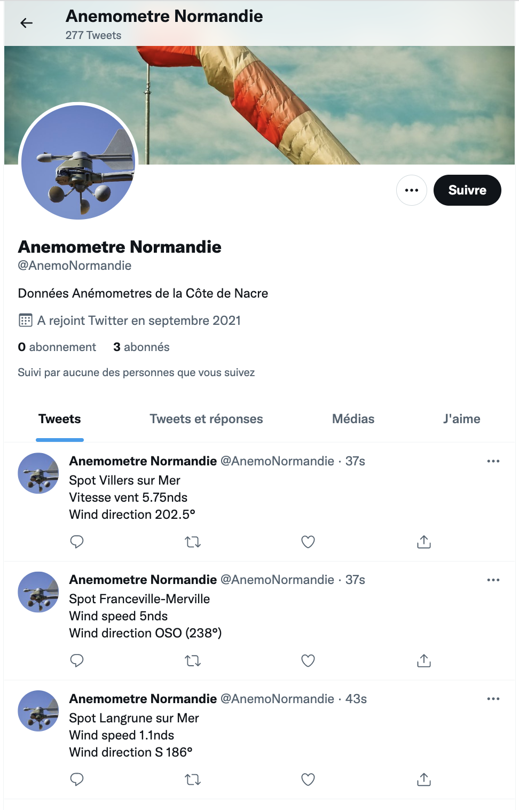
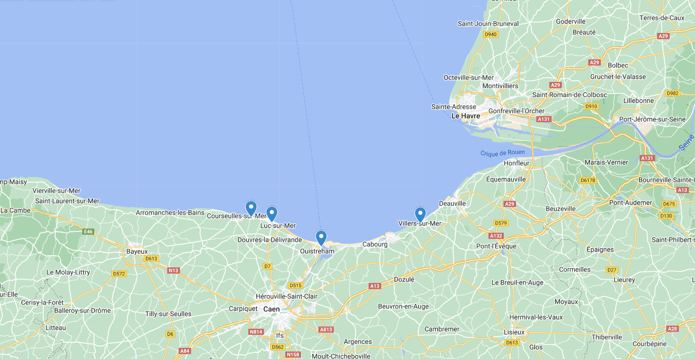

# Anemometer Normandie Twitter Bot
Anemometer Normandie is a twitter bot (<a href=https://twitter.com/AnemoNormandie>@AnemoNormandie</a>) that tweets wind data from different anemometers located in normandy (France).

Thanks to this twitter bot, the information of the different spots in the region is available in one place. This allows windsurfers, kitesurfers, sailors and others to know in real time the wind on the different spots in one click in order to ensure that the different wind data are consistent.

## Sources/spots :

* Villers sur Mers, France : https://www.openwindmap.org/PP562
* Bernieres sur mer, CVB, France : https://www.windguru.cz/station/1147
* Langrune sur Mer, France : https://www.windguru.cz/station/1495
* Ouistreham, France https://data.diabox.com/?id=114 (currently under maintenance)

## Location

## How to run the project

1) Clone the repo
2) Download the lastest chrome driver version on https://sites.google.com/chromium.org/driver/
3) Open the repo with PyCharm community (https://www.jetbrains.com/fr-fr/pycharm/download/) or any other Python IDE
4) Run the following command on your folder 'pip install selenium'
5) Run the following command on your folder 'pip install tweepy'
6) Create an access.py file in the repo and add the followings values from twitter (see https://docs.tweepy.org/en/stable/install.html to know how to do it)

    * API_KEY =
    * API_SECRET =
    * ACCESS_TOKEN =
    * ACCESS_TOKEN_SECRET =
    
7) Run the project :)

## Technology
Python 3.8.5

Selenium 4

Tweepy https://docs.tweepy.org/en/stable/install.html

## Licence 
Autor : Timothée Marguier

Licence : GNU GENERAL PUBLIC LICENSE
